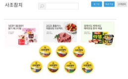
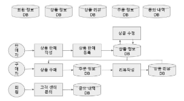
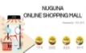

**NUGUNA          ONLINE SHOPPING MALL**

Presented by : 사조 참치

   

이준섭 최영복 최승만 함은정

**목차**

01 02 03

**제안 배경 및 필요성 달성 목표 흐름도**

04 05

**SWOT 분석 Q & A**

1. 제안 배경 및 필요성

**웹 취약계층을 위한 온라인 쇼핑몰 만들기**

**차별성**

  

**보기 편한 UI 읽어주기 상품 맞춤 추천**

액티브 시니어 및 장애인 등 웹 TTS API를 활용하여 시각 취약계층의 주 소비층을 취약계층들도 쉽게 접근 할 수 있는 장애인을 위한 페이지를 분석하여 자주 찾거나 필요로 기능 읽어 주는 기능 하는 상품을 추천하는 기능

2. 달성 목표

**메인 페이지**

**상품 등록 페이지**

**상품 비교 페이지**

3. 흐름도

4. SWOT 분석

STRENGTHS OPPORTUNITIES

- 코로나로 인해 웹 쇼핑몰 사용량 증가
- 웹 취약계층이 쉽게 사용 가능

WEAKNESSES THREATS

- 웹 취약계층을 위한 정책의 부족 - 기존 업체들과의 경쟁

Q & A

감사합니다. 

참고 문헌

채진미(2020), “액티브 시니어 소비자들의 구매행동”, 한국의류산업학회지. 이근호(2022). “디지털 소외계층을 위한 디지털 역량 강화 교육 모델 설계”, 사물인터넷융복합논문지

TTAK.KO-08.0059, 사회적 약자(정보취약계층)를 위한 무인정보 단말기 사용자 입출력 기능 요구사항

이슈메이커, “실버경제”, http[://www.issuemaker.kr, (2](http://www.issuemaker.kr/)023.02.22)
